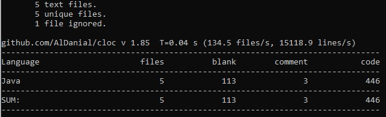
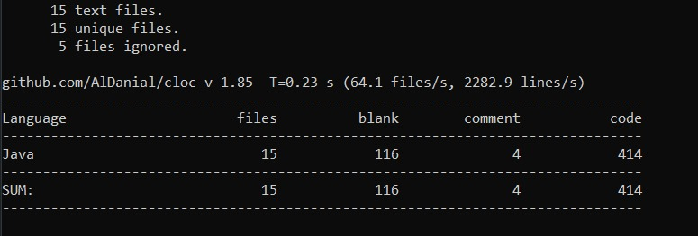

# CORREÇÃO DE SOLO

## Situação antes de realizar os ajustes:
Ferramenta utilizada para analisar o Código: cloc (Disponível em: https://github.com/AlDanial/cloc)

Imagem a partir do diretório arquitetura-software-2020/src/main:

Comando executado:
```sh
$ cloc java
```

- Quantidade de estruturas condicionais: 9
- Quantidade de pontos a realizar alterações: 4 (listado a seguir)

## Problemas identificados:
- Entrada de dados realizado no console
  
  Soluçao: Remoção de entrada de dados pelo console
  
- Métodos com muitas responsabilidades
  
  Solução: Divisão dos métodos em partes menores
  
- O sistema não calcula outros nutrientes que são fornecidos pelo fósforo
  
  Solução: implementação dos cálculos: FosforoForneceCalcio, FosforoForneceEnxofre, FosforoForneceMagnesio, FosforoForneceNitrogenio
- Falta de padrão
  
  Solução: Utilização do design pattern Observer
  
  Principais referências utilizadas:
  
  Java Design (https://java-design-patterns.com/patterns/observer/)
  
  Refactoring Guru (https://refactoring.guru/design-patterns/observer)
  
  Alura (https://www.alura.com.br/curso-online-introducao-design-patterns-java)

## Situação após realizar os ajustes:

Imagem a partir do diretório arquitetura-software-2020/src/main:

- Quantidade de estruturas condicionais: 4
### Solução dos problemas identificados:
- Remoção de entrada de dados pelo console: https://github.com/raqueltsato/arquitetura-software-2020-02/commit/dc6cea908e521415d8460285f88e673818dc1d24
- Divisão dos métodos em partes menores: https://github.com/raqueltsato/arquitetura-software-2020-02/commit/dc6cea908e521415d8460285f88e673818dc1d24
- Implementação dos cálculo dos nutrientes fornecidos pelo fósforo: https://github.com/raqueltsato/arquitetura-software-2020-02/commit/2fe3e590e22a7e0031a40a1e6f616484f935c23a
- Utilização do design pattern na correção de fósforo: https://github.com/raqueltsato/arquitetura-software-2020-02/commit/2fe3e590e22a7e0031a40a1e6f616484f935c23a
- Utilização do design pattern Observer na correção de potássio: https://github.com/raqueltsato/arquitetura-software-2020-02/commit/df3854aa2a8f8c74205a93ab5c125bf6ec348392
